# 🖥️ macOS (Install & Product) Icons

---

## Mac OS X 10.0 Cheetah (2001)

## Mac OS X 10.1 Puma (2001)

## Mac OS X 10.2 Jaguar (2002)

## Mac OS X 10.3 Panther (2003)

## Mac OS X 10.4 Tiger (2005)

## Mac OS X 10.5 Leopard (2007)

## Mac OS X 10.6 Snow Leopard (2009)

## OS X 10.7 Lion (2011)

|                 | Install                                                      | Product                                                      |
| --------------- | ------------------------------------------------------------ | ------------------------------------------------------------ |
| PNG (16x16)     |        |        |
| PNG (32x32)     |        |        |
| PNG (64x64)     |        |        |
| PNG (128x128)   |     |     |
| PNG (256x256)   | 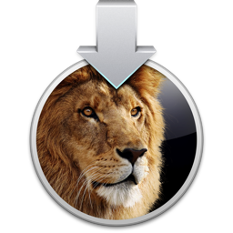    |     |
| PNG (512x512)   | 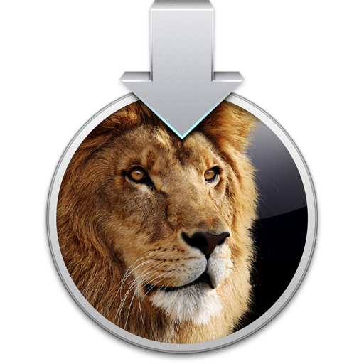    |     |
| PNG (1024x1024) | 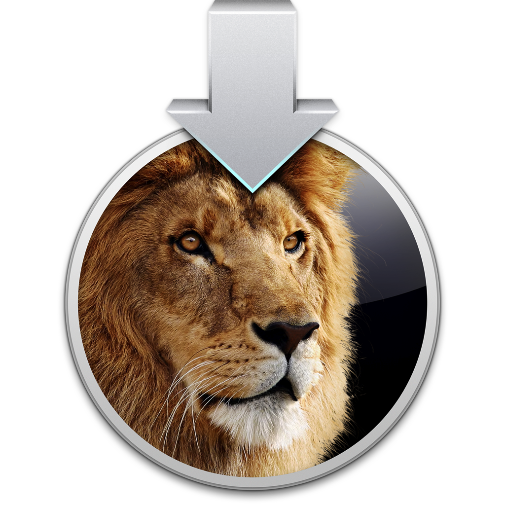 |  |

### ICNS Files

- [Install.icns](./assets/10.7/install.icns)
- [Product.icns](./assets/10.7/product.icns)

## OS X 10.8 Mountain Lion (2012)

|                 | Install                                                      | Product                                                      |
| --------------- | ------------------------------------------------------------ | ------------------------------------------------------------ |
| PNG (16x16)     |        |        |
| PNG (32x32)     |        |        |
| PNG (64x64)     |        |        |
| PNG (128x128)   | 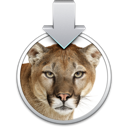    |     |
| PNG (256x256)   | 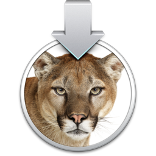    |     |
| PNG (512x512)   | 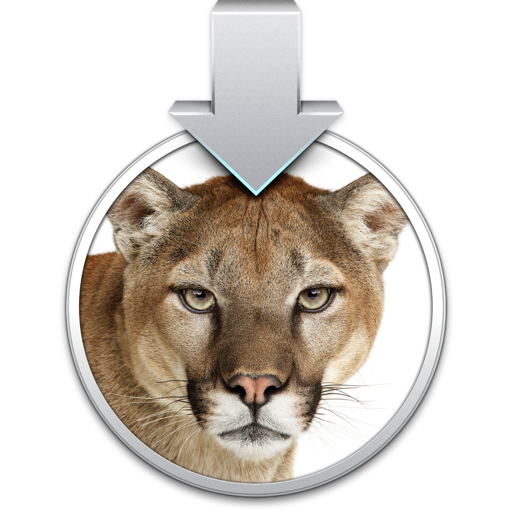    |     |
| PNG (1024x1024) | 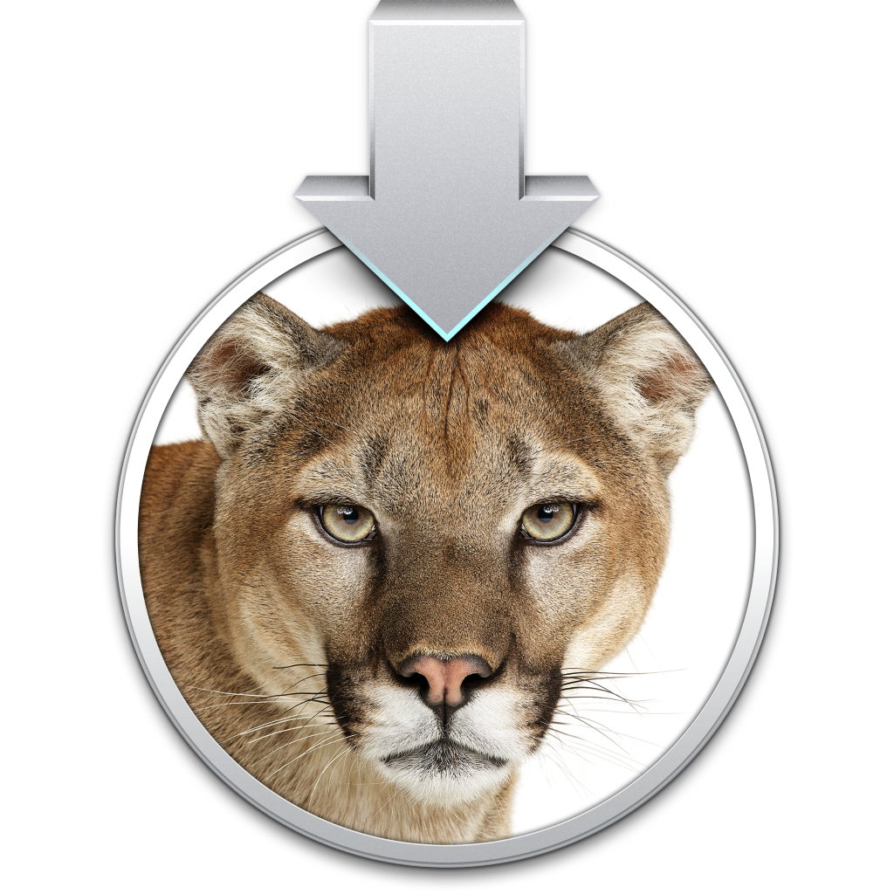 |  |

### ICNS Files

- [Install.icns](./assets/10.8/install.icns)
- [Product.icns](./assets/10.8/product.icns)

## OS X 10.9 Mavericks (2013)

## OS X 10.10 Yosemite (2014)

|                 | Install                                                       | Product                                                       |
| --------------- | ------------------------------------------------------------- | ------------------------------------------------------------- |
| PNG (16x16)     |        |        |
| PNG (32x32)     |        |        |
| PNG (64x64)     |        |        |
| PNG (128x128)   | 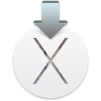    | 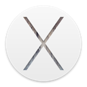    |
| PNG (256x256)   | 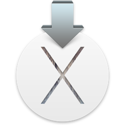    | 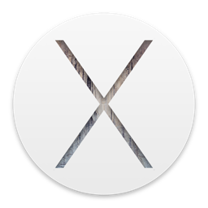    |
| PNG (512x512)   |     | 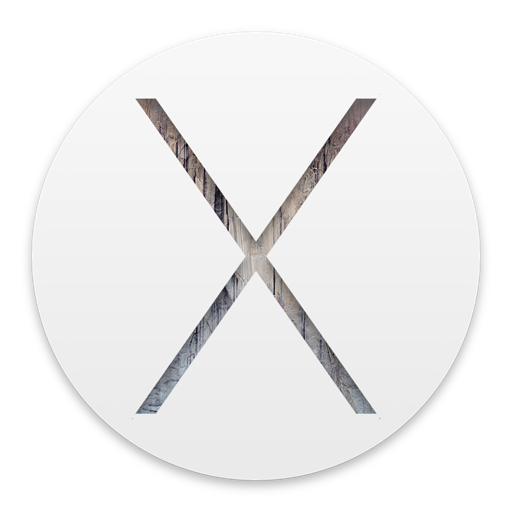    |
| PNG (1024x1024) | 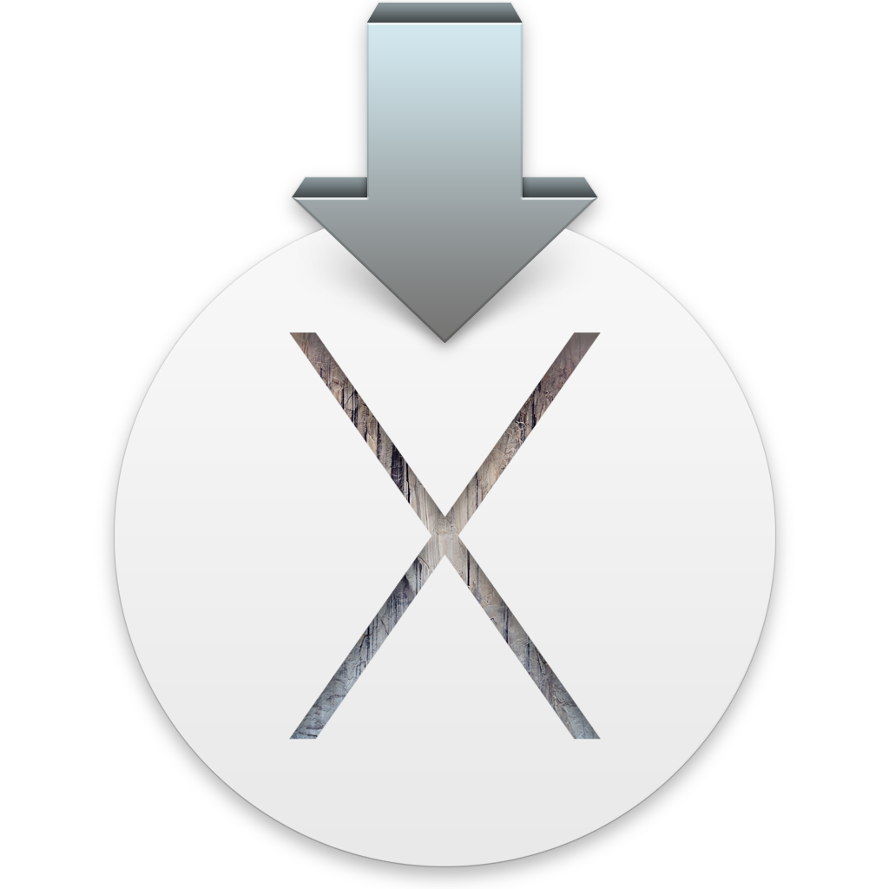 | 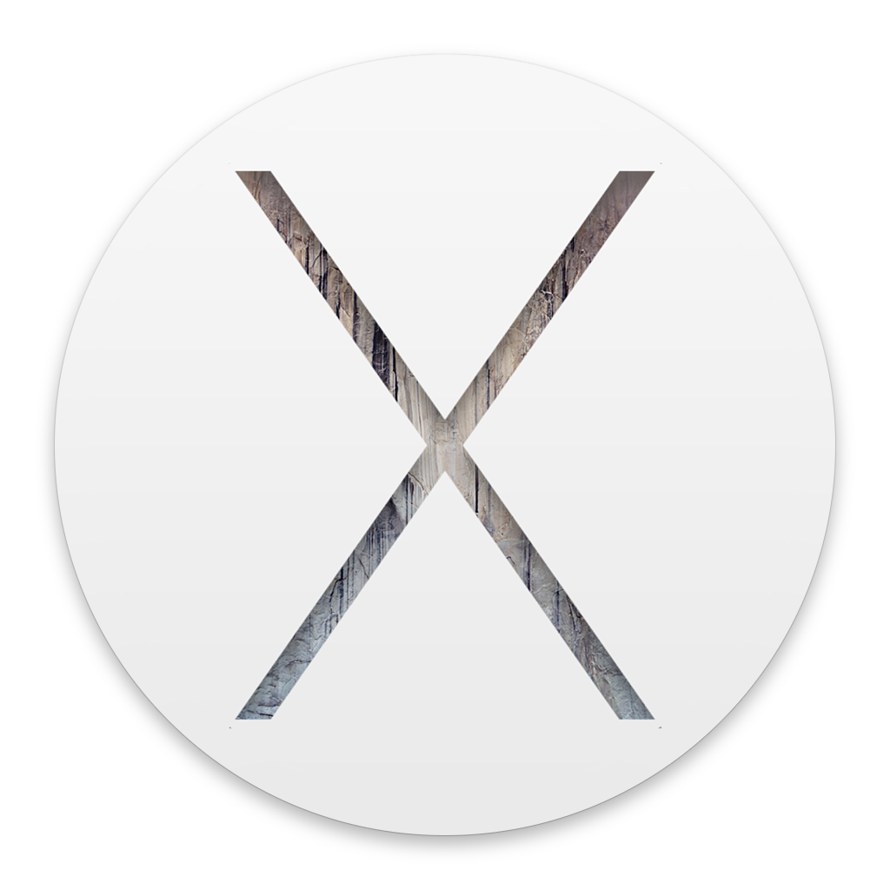 |

### ICNS Files

- [Install.icns](./assets/10.10/install.icns)
- [Product.icns](./assets/10.10/product.icns)

## OS X 10.11 El Capitan (2015)

|                 | Install                                                       | Product                                                       |
| --------------- | ------------------------------------------------------------- | ------------------------------------------------------------- |
| PNG (16x16)     |        |        |
| PNG (32x32)     |        |        |
| PNG (64x64)     |        |        |
| PNG (128x128)   | 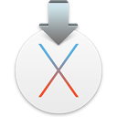    |     |
| PNG (256x256)   |     | 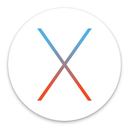    |
| PNG (512x512)   | 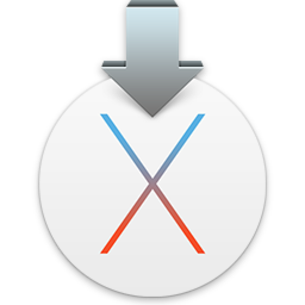    |     |
| PNG (1024x1024) | 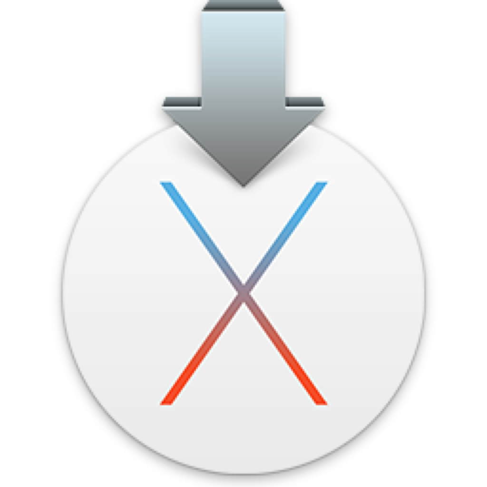 |  |

### ICNS Files

- [Install.icns](./assets/10.11/install.icns)
- [Product.icns](./assets/10.11/product.icns)

## macOS 10.12 Sierra (2016)

|                 | Install                                                       | Product                                                       |
| --------------- | ------------------------------------------------------------- | ------------------------------------------------------------- |
| PNG (16x16)     |        |        |
| PNG (32x32)     |        |        |
| PNG (64x64)     |        |        |
| PNG (128x128)   |     |     |
| PNG (256x256)   |     | 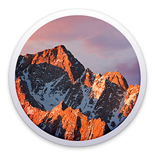    |
| PNG (512x512)   | 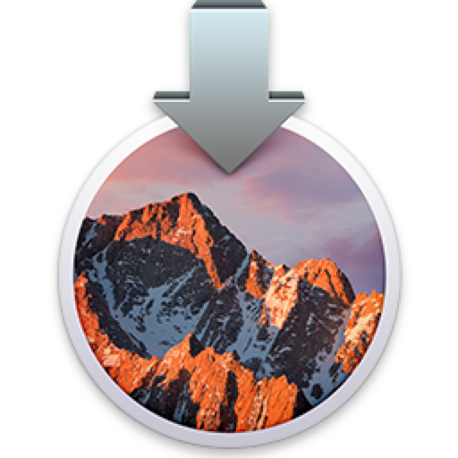    |     |
| PNG (1024x1024) |  |  |

### ICNS Files

- [Install.icns](./assets/10.12/install.icns)
- [Product.icns](./assets/10.12/product.icns)

## macOS 10.13 High Sierra (2017)

## macOS 10.14 Mojave (2018)

## macOS 10.15 Catalina (2019)

## macOS 11.0 Big Sur (2020)

## macOS 12.0 Monterey (2021)

|                 | Install                                                      | Product                                                      |
| --------------- | ------------------------------------------------------------ | ------------------------------------------------------------ |
| PNG (16x16)     |        |        |
| PNG (32x32)     |        |        |
| PNG (64x64)     |        |        |
| PNG (128x128)   |     | 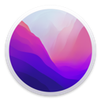    |
| PNG (256x256)   | 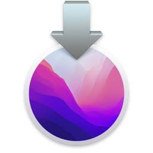    | 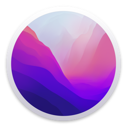    |
| PNG (512x512)   |     | 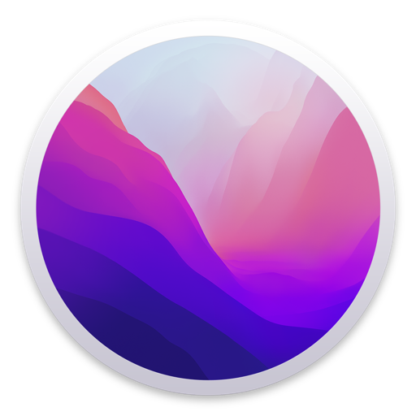    |
| PNG (1024x1024) | 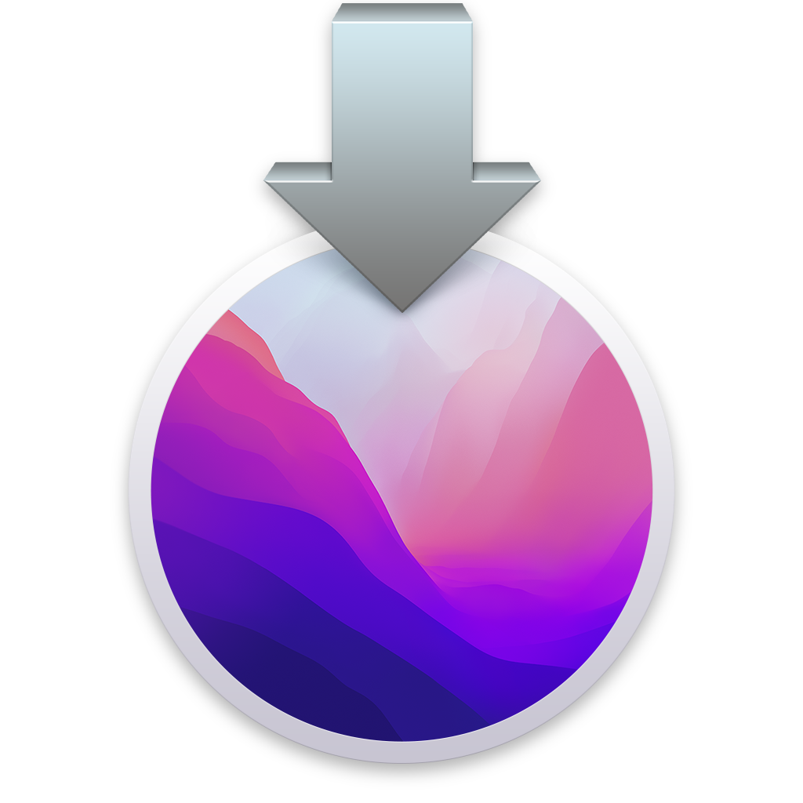 | 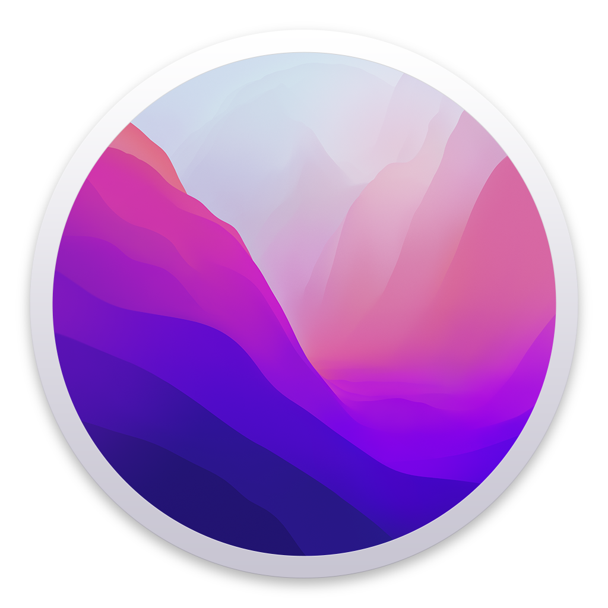 |

### ICNS Files

- [Install.icns](./assets/12.0/install.icns)
- [Product.icns](./assets/12.0/product.icns)

## macOS 13.0 Ventura (2022)

|                 | Install                                                      | Product                                                      |
| --------------- | ------------------------------------------------------------ | ------------------------------------------------------------ |
| PNG (16x16)     |        |        |
| PNG (32x32)     |        |        |
| PNG (64x64)     |        |        |
| PNG (128x128)   |     |     |
| PNG (256x256)   |     |     |
| PNG (512x512)   | 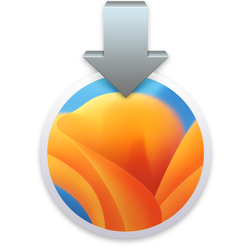    |     |
| PNG (1024x1024) |  |  |

### ICNS Files

- [Install.icns](./assets/13.0/install.icns)
- [Product.icns](./assets/13.0/product.icns)

## macOS 14.0 Sonoma (2023)

|                 | Install                                                      | Product                                                      |
| --------------- | ------------------------------------------------------------ | ------------------------------------------------------------ |
| PNG (16x16)     |        |        |
| PNG (32x32)     |        |        |
| PNG (64x64)     |        |        |
| PNG (128x128)   | 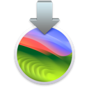    |     |
| PNG (256x256)   |     |     |
| PNG (512x512)   | 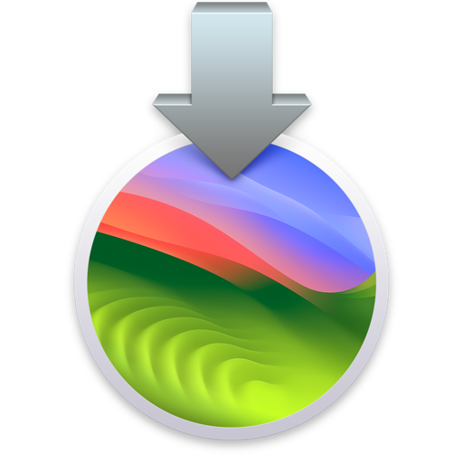    |     |
| PNG (1024x1024) | 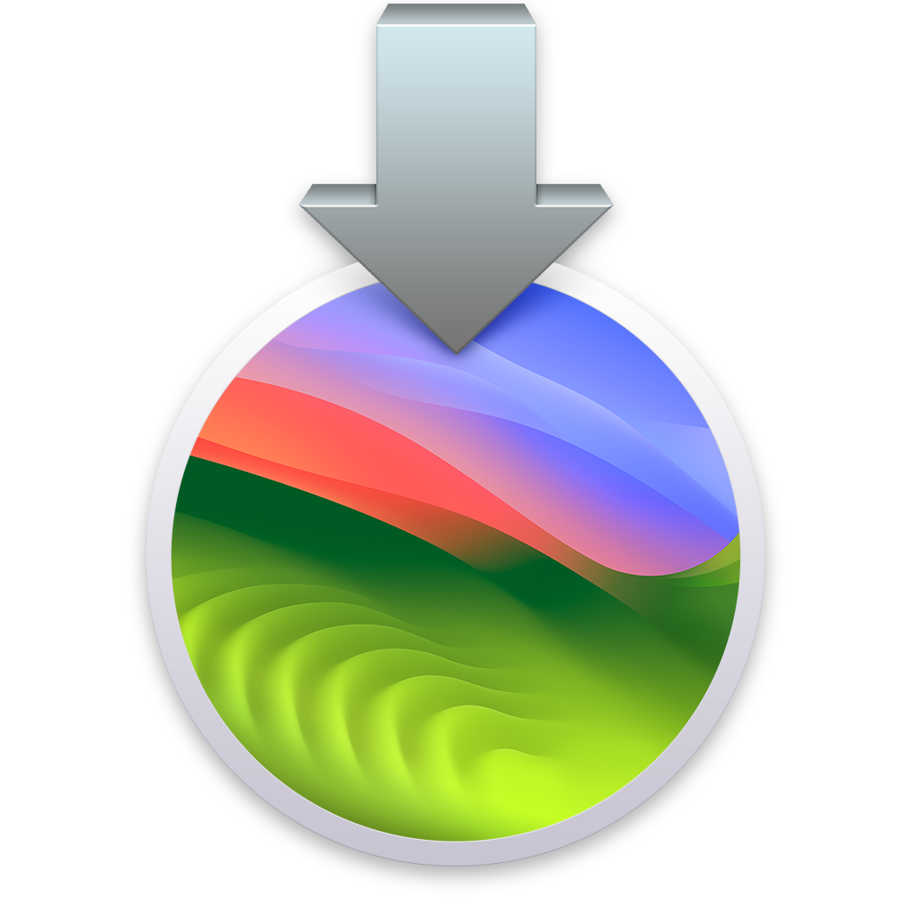 | 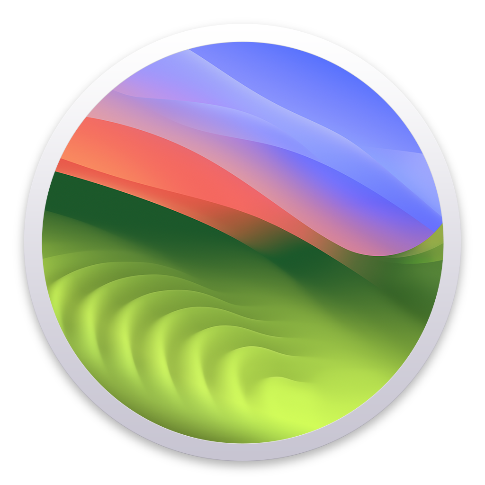 |

### ICNS Files

- [Install.icns](./assets/14.0/install.icns)
- [Product.icns](./assets/14.0/product.icns)
