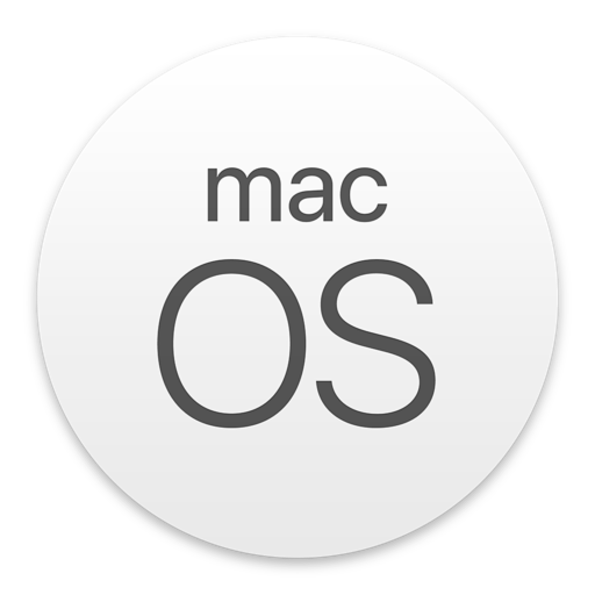

# 🖥️ macOS Versions (2001 – 2024)

[](https://opensource.org/licenses/MIT)

<div style="display: flex; flex-wrap: nowrap; overflow-x: auto; justify-content: center;">


</div>

| Version       | Name          | Date               | Product                                                                              | Installer                                                                            |
| ------------- | ------------- | ------------------ | ------------------------------------------------------------------------------------ | ------------------------------------------------------------------------------------ |
| Mac OS X 10.0 | Cheetah       | March 24, 2001     | [](./versions/10.0/product.icns)   | [](./versions/10.0/install.icns)   |
| Mac OS X 10.1 | Puma          | September 25, 2001 | [](./versions/10.1/product.icns)   | [](./versions/10.1/install.icns)   |
| Mac OS X 10.2 | Jaguar        | August 23, 2002    | [](./versions/10.2/product.icns)   | [](./versions/10.2/install.icns)   |
| Mac OS X 10.3 | Panther       | October 24, 2003   | [](./versions/10.3/product.icns)   | [](./versions/10.3/install.icns)   |
| Mac OS X 10.4 | Tiger         | April 29, 2005     | [](./versions/10.4/product.icns)   | [](./versions/10.4/install.icns)   |
| Mac OS X 10.5 | Leopard       | October 26, 2007   | [](./versions/10.5/product.icns)   | [](./versions/10.5/install.icns)   |
| Mac OS X 10.6 | Snow Leopard  | August 28, 2009    | [](./versions/10.6/product.icns)   | [](./versions/10.6/install.icns)   |
| Mac OS X 10.7 | Lion          | July 20, 2011      | [](./versions/10.7/product.icns)   | [](./versions/10.7/install.icns)   |
| OS X 10.8     | Mountain Lion | July 25, 2012      | [](./versions/10.8/product.icns)   | [](./versions/10.8/install.icns)   |
| OS X 10.9     | Mavericks     | October 22, 2013   | [](./versions/10.9/product.icns)   | [](./versions/10.9/install.icns)   |
| OS X 10.10    | Yosemite      | October 16, 2014   | [](./versions/10.10/product.icns) | [](./versions/10.10/install.icns) |
| OS X 10.11    | El Capitan    | September 30, 2015 | [](./versions/10.11/product.icns) | [](./versions/10.11/install.icns) |
| macOS 10.12   | Sierra        | September 20, 2016 | [](./versions/10.12/product.icns) | [](./versions/10.12/install.icns) |
| macOS 10.13   | High Sierra   | September 25, 2017 | [](./versions/10.13/product.icns) | [](./versions/10.13/install.icns) |
| macOS 10.14   | Mojave        | September 24, 2018 | [](./versions/10.14/product.icns) | [](./versions/10.14/install.icns) |
| macOS 10.15   | Catalina      | October 7, 2019    | [](./versions/10.15/product.icns) | [](./versions/10.15/install.icns) |
| macOS 11      | Big Sur       | November 12, 2020  | [](./versions/11.0/product.icns)   | [](./versions/11.0/install.icns)   |
| macOS 12      | Monterey      | October 25, 2021   | [](./versions/12.0/product.icns)   | [](./versions/12.0/install.icns)   |
| macOS 13      | Ventura       | October 24, 2022   | [](./versions/13.0/product.icns)   | [](./versions/13.0/install.icns)   |
| macOS 14      | Sonoma        | September 26, 2023 | [](./versions/14.0/product.icns)   | [](./versions/14.0/install.icns)   |
| macOS 15      | Sequoia       | September 16, 2024 | [](./versions/15.0/product.icns)   | [](./versions/15.0/install.icns)   |
| macOS 26      | Tahoe (βeta)  | June 9, 29025      | [](./versions/26.0/product.icns)   | [](./versions/26.0/install.icns)   |

# 🚀 Export .PNG from .ICNS

```bash
sips -s format png <input_file>.icns --out <output_file>.png --resampleWidth <width>
```

## 🏖️ Example

```bash
sips -s format png install.icns --out install_16x16.png --resampleWidth 16
```
